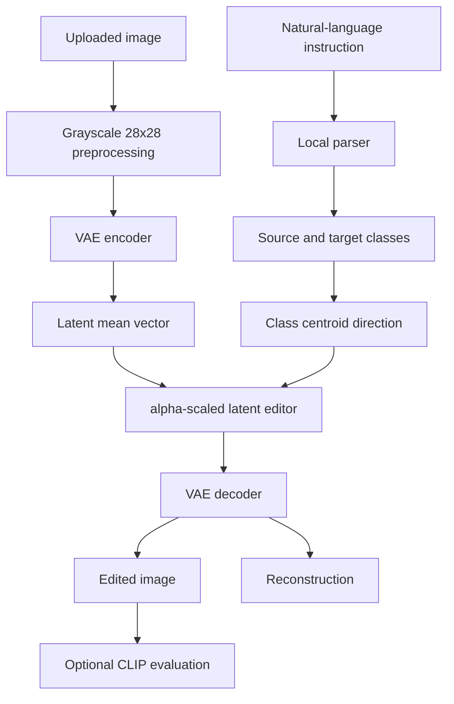

# Architecture

```mermaid
flowchart TD
    A[Uploaded image] --> B[Grayscale 28x28 preprocessing]
    C[Natural-language instruction] --> D[Local parser]
    D --> E[Source and target classes]
    B --> F[VAE encoder]
    F --> G[Latent mean vector]
    E --> H[Class centroid direction]
    G --> I[alpha-scaled latent editor]
    H --> I
    I --> J[VAE decoder]
    J --> K[Edited image]
    J --> L[Reconstruction]
    K --> M[Optional CLIP evaluation]
```
